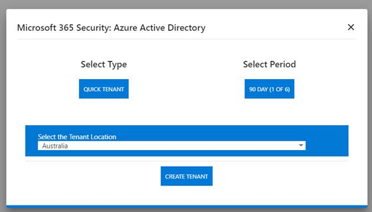
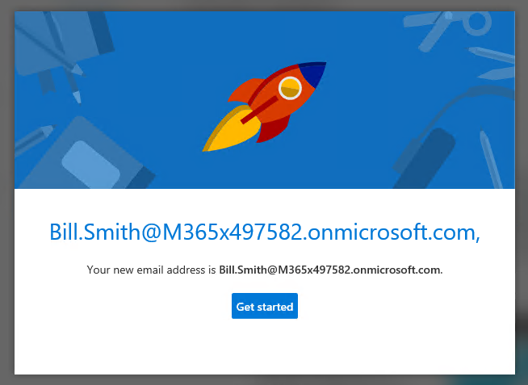

Document Information
--------------------

| Date       | Document owner | Version | Description of reporting                            |
|------------|----------------|---------|-----------------------------------------------------|
| 26/02/2019 | Vic Perdana    | 1.01    | Mock 004 – Azure AD Identity and Conditional Access |

Estimated time / effort
-----------------------

-   Preps and familiarization: 8 hrs

-   Build: 24 hrs

-   Presentation: 2 hrs

Objectives
----------

The objective of this project is to familiarize yourself with Azure Active
Directory Identity capabilities. At the end of this project, it is expected you
will have an understanding of the fundamental Azure Active Directory (AAD)
integration know-how including: how to set up an Azure AD infrastructure, sync
on-premises AD identities, and enable single sign on for modern clients i.e.
Windows 10.

Case Study
----------

Contoso is a startup company – they already have an existing Active Directory
and have recently purchased Microsoft 365 plans. They would like the single sign
on (SSO) ability for their users when accessing Office 365 apps. Additionally,
access to Office 365 Exchange Online must be restricted to *managed devices
only*.

The outcome for this project is for you to create an SSO experience for (at
least one) Contoso users:

1.  Create a functioning Active Directory environment

2.  Install an Azure Active Directory Connect (AAD Connect)

3.  Configure Password Hash Sync (PHS) in AAD Connect

4.  Perform Hybrid Azure AD join on a Windows 10 VM

5.  Restrict access to Exchange Online to managed devices

To complete this project the following components are required.

1.  Deploy the *lab-hybrid-phs*
    [template](https://scm.dimensiondata.com/Vic.Perdana/digitalworkplacevic/tree/master/mockup004/lab-hybrid-phs)
    (NoClient.json) – use the previous Mock to deploy template if required. This
    will deploy a new Active Directory environment consisting of a fully
    configured forest, 4 test users with a single Domain Controller, as well as
    an installed AAD Connect instance.

2.  Create a demo Office 365 tenant on <https://demos.microsoft.com/>

    

    1.  Select Work Account

    2.  Log on using your dimensiondata.com address

    3.  Select *Microsoft 365 Security: Azure Active Directory Get Environment*

    4.  Details to access the environment will be provided (including
        credentials)

3.  Integrate the Active Directory environment with your tenant

    1.  Add an UPN suffix of *\<yourtenantID\>*.onmicrosoft.com

    2.  Configure test users with the new UPN

    3.  Configure AAD Connect with PHS

    4.  Sync the users, then assign the users with an appropriate O365 license

    5.  Configure Device Options for Hybrid Azure AD join

4.  Create a new Windows 10 VM and join it to the domain (hint: logon using the
    test user’s UPN)

5.  Configure a Conditional Access policy to restrict access to Exchange Online
    via managed devices

6.  Schedule a time to demonstrate a single sign on experience using a test user
    as well as the managed devices restriction

Timeline
--------

The demonstration of a successful deployment needs to be completed prior to the
**15th of March 2019**.

Appendix 
---------

*Note:* Some screenshots of a working solution are highlighted below.

*Single Sign On from a managed / domain-joined device.*

<https://myapps.microsoft.com>

*Accessing Outlook should not prompt any additional authentication*

*Blocked access from a non-domain joined machine*

![CONTOSO demo bill.smith\@m365x497582.onmicrosoft.com You can't get there from here This application contains sensitive information and can only be accessed from: Contoso domain joined devices. Access from personal devices is not allowed. Since you're using Chrome, you need to install this extension. You must be on Windows 10 version 1703 and above. Please click here for details. Alternatively, you can use Microsoft Edge or Internet Explorer to access this application. If you're not planning to do this right now, you might still be able to browse to other Contoso sites. Otherwise, sign out to protect your account. Sign out and sign in with a different account More details Contoso ](media/a510385bd834be0f04e62c82cbe3a667.png)
